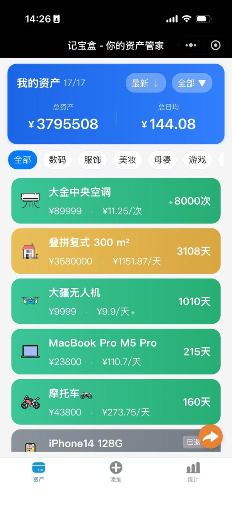
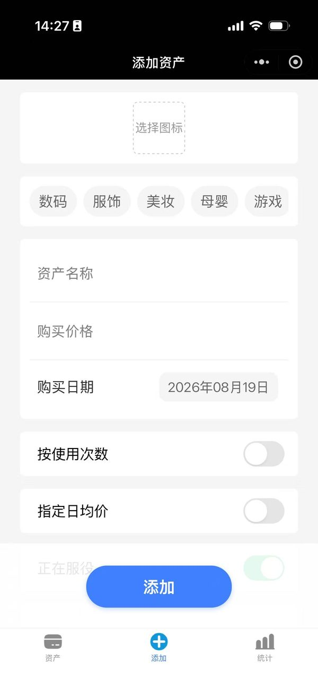
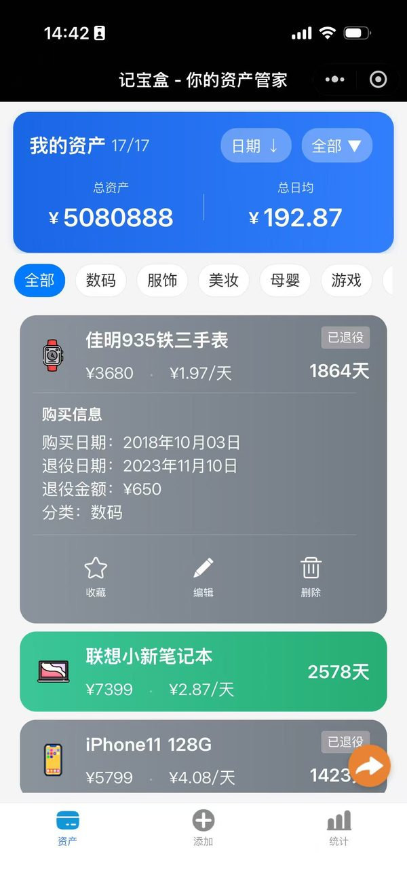
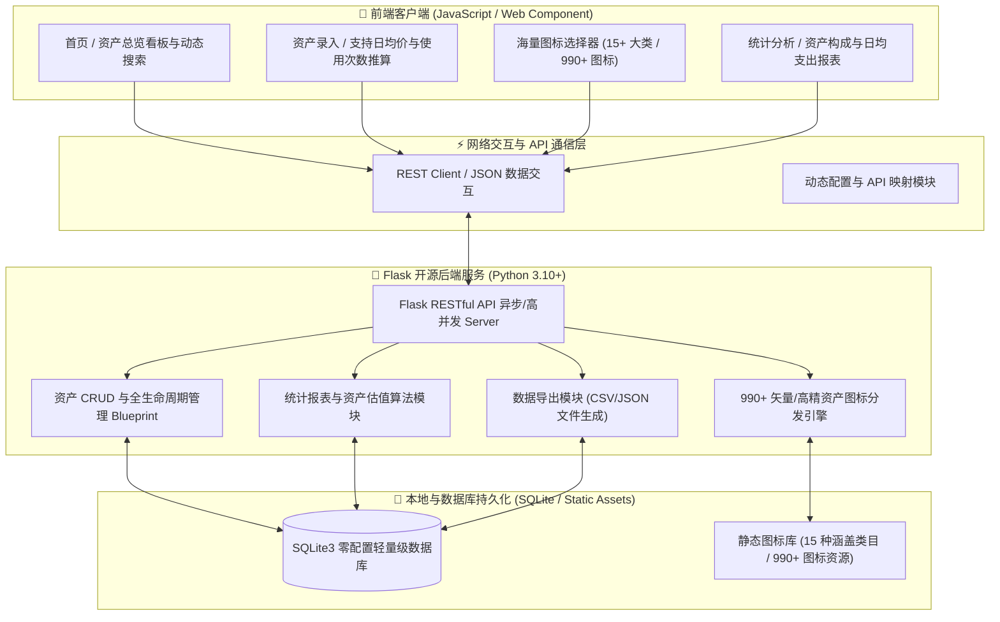

<div align="center">


# 📦 记宝盒 (jibaohe)

**现代化开源全生命周期个人与家庭资产管理应用**

[](LICENSE)
[](pages)
[](backend)
[](backend)
[](backend)
[](#-核心特性)

<p align="center">
<a href="#️-系统架构">系统架构</a> •
<a href="#-核心特性">核心特性</a> •
<a href="#-界面预览">界面预览</a> •
<a href="#-快速开始">快速开始</a> •
<a href="#-项目目录结构">项目目录结构</a> •
<a href="#-配置说明">配置说明</a> •
<a href="#-联系作者">联系作者</a> •
<a href="#-开源协议">开源协议</a>
</p>

记宝盒 (jibaohe) 是一款专为个人和家庭打造的 **开源个人资产全生命周期管理应用**。

项目由 **轻量化前端客户端** 与 **RESTful Python 后端 (Flask + 零配置 SQLite)** 构成，通过极致简洁与优雅的视觉交互，助你轻松记录每一份资产从购入、服役、摊销到退役全过程，实现资产价值与日均持有成本的精准量化。

</div>

---

## 📱 界面预览

<div align="center">

| 资产概览 (首页) | 丰富图标选择 (990+款) | 资产录入与定义 | 退役资产与残值结算 |
| :---: | :---: | :---: | :---: |
|  |  |  |  |

</div>

---

## 🏗️ 系统架构

记宝盒采用 **前后端解耦、端云协同** 架构：



---

## ✨ 核心特性

- 🎨 **近千款海量高精资产图标库（15+主流大类全覆盖）**：内置 **990+ 款** 精美高精资产图标，涵盖 **数码、服饰、美妆、母婴、游戏、乐器、交通、体育、电器、家具、工具、艺术、玩具、健身、房产** 等 15+ 种细分领域，大幅提升资产归类时的视觉辩识度与个性化体验。
- 🏷️ **灵活多维的状态筛选与精选收藏**：
  - **精选收藏**：一键星标高频或核心资产，精准过滤快速查阅。
  - **退役/服役状态**：支持 **全部、现役（服役中）、退役（历史结算）、精选收藏** 四大维度自由切换。
  - **全类目独立筛选**：可按数码、电器、房产等 15+ 种大类快速精细化过滤。
- 📊 **丰富多样的灵活排序方式**：
  - 🕒 **按时间维度**：支持 **最新添加 ↓ / 最早添加 ↓ / 使用天数从高到低 / 使用天数从低到高** 灵活排序。
  - 💰 **按均价维度**：支持 **日均从高到低 ↓ / 日均从低到高 ↑** 排序，精准洞察每日摊销持有成本最高或最省钱的资产。
  - 📅 **按日期维度**：支持 **购买日期从早到晚 ↓ / 从晚到早 ↑** 排序，轻松追踪资产购入流水与时间轴。
  - 🏷️ **按价格维度**：支持 **价格从高到低 ↓ / 价格从低到高 ↑** 排序，资产价值高低一目了然。
- ♻️ **全生命周期追踪与退役残值量化**：完整记录物品 **购买价格、购买日期、预期/实际使用天数、日均持有成本**，支持资产“退役”操作并录入退役折旧残值，实时计算资产实际磨损成本与剩余价值。
- 📉 **可视化财务统计与消费分析**：自动汇总全盘资产总额、全员日均持有支出，并生成多维度分布报表，为家庭与个人的再消费决策提供科学依据。
- 🔒 **数据自主掌控与一键导出**：支持标准 REST API 接口与 CSV 数据批量导出，所有数据存储于本地 SQLite，无隐私泄露顾虑。

---

## 📁 项目目录结构

```text
jibaohe/
├── docs/                     # 项目文档与展示资源
│   └── images/              # README 预览截图与 Logo 资源
├── pages/                    # 前端业务页面
│   ├── index/               # 首页：资产概览、多维筛选与动态排序
│   ├── add/                 # 功能：添加新资产与摊销成本设置
│   ├── edit/                # 功能：编辑资产信息与状态变更
│   ├── select-icon/         # 功能：990+ 海量图标分类选择器
│   ├── statistics/          # 数据：统计图表与分布可视化展示
│   └── user/                # 我的：数据导出与个人设置
├── utils/                    # 前端工具库
│   ├── config.example.js    # 客户端配置模板
│   └── util.js              # 时间格式化与算法工具
├── images/                   # 界面静态 UI 图标
├── backend/                  # Flask RESTful 后端服务
│   ├── app.py               # 入口：Flask 应用服务启动入口
│   ├── init_db.py           # 工具：一键初始化 SQLite 数据库
│   ├── schema.sql           # 数据库表结构定义
│   ├── requirements.txt     # Python 依赖清单
│   ├── .env.example         # 后端环境变量模板
│   ├── configs/             # 服务配置与日志控制
│   ├── api/                 # REST API 蓝图路由
│   │   ├── login/          # 用户鉴权与会话管理
│   │   ├── users/          # 用户信息管理
│   │   ├── items/          # 资产 CRUD 及退役清算
│   │   ├── export/         # 资产 CSV 数据导出
│   │   └── report/         # 资产统计分析与报表
│   └── static/              # 静态资源 (990+ 资产图标库)
│       └── icons/           # 15 大类高精图标分类目录
├── LICENSE                   # MIT 开源协议
└── README.md                 # 项目说明文档
```

---

## 🚀 快速开始

### 1. 前端客户端

#### 环境与配置准备

1. 克隆项目仓库到本地：
   ```bash
   git clone https://github.com/ucmao/jibaohe.git
   cd jibaohe
   ```
2. 初始化前端配置文件：
   ```bash
   cp utils/config.example.js utils/config.js
   ```
3. 根据实际部署环境，修改 `utils/config.js` 中的 API 访问域名与接口配置。

---

### 2. 后端服务 (Flask + SQLite)

#### 初始化与启动步骤

1. 进入后端目录并创建 Python 虚拟环境：
   ```bash
   cd backend

   # 创建虚拟环境
   python3 -m venv .venv
   source .venv/bin/activate   # Windows 用户使用: .venv\Scripts\activate

   # 安装依赖
   pip install -r requirements.txt
   ```

2. 配置环境变量：
   ```bash
   cp .env.example .env
   # 编辑 .env 文件，配置 BASE_URL 及服务端口
   ```

3. 初始化 SQLite 数据库：
   ```bash
   python init_db.py
   ```

4. 启动后端 API 服务：
   ```bash
   python app.py
   # 服务默认运行在 http://0.0.0.0:5007
   ```

---

## 🔌 配置说明

### 前端配置项 (`utils/config.js`)

| 配置项 | 描述 | 示例值 |
| --- | --- | --- |
| `domain` | 后端 API 请求域名/地址 | `http://localhost:5007` |
| `appName.full` | 应用名称 | `记宝盒` |
| `apiPath.login` | 登录鉴权接口路径 | `/api/login` |
| `staticPath` | 默认分享/静态资源路径 | `/static/default/share-image.jpg` |

### 后端配置项 (`backend/.env`)

| 配置项 | 描述 | 示例值 |
| --- | --- | --- |
| `BASE_URL` | 服务器基础访问地址 | `http://localhost:5007` |
| `DATABASE_URI` | 数据库连接字符串 | `sqlite:///jibaohe.db` |
| `SECRET_KEY` | 应用 Session 加密密钥 | `your-secret-key` |

---

## 📩 联系作者与交流

如果您在安装、使用过程中遇到问题，或有功能定制需求，欢迎通过以下方式联系：

- **微信**：csdnxr
- **QQ**：294323976
- **邮箱**：[leoucmao@gmail.com](mailto:leoucmao@gmail.com)
- **Bug 反馈与建议**：[GitHub Issues](https://github.com/ucmao/jibaohe/issues)
- **官方仓库**：[ucmao/jibaohe](https://github.com/ucmao/jibaohe)

---

## ⚖️ 开源协议 & 免责声明

1. 本项目基于 **[MIT LICENSE](LICENSE)** 协议开源。
2. **免责声明**：本项目主要用于个人资产管理与学习交流。在生产环境部署时，建议使用 HTTPS 加密传输并妥善设置 API 访问权限。

<div align="center">

**记宝盒 (jibaohe)** - 让每一份资产的全生命周期管理更简单！ 📦💼✨

</div>
